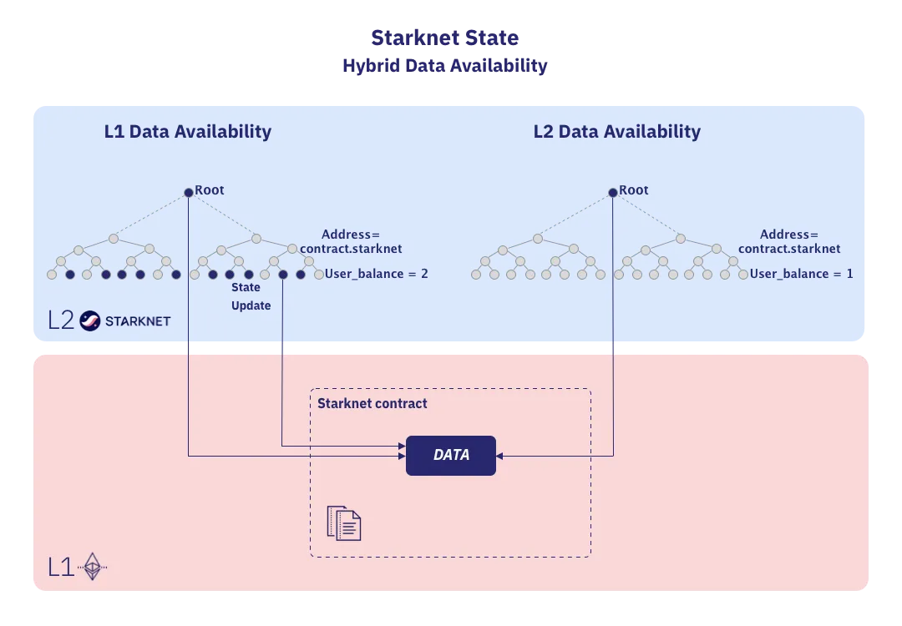

# Bytecode Storage Methods for Kakarot on Starknet

The bytecode is the compiled version of your contract, and it is what the
Kakarot EVM will execute when you call the contract. As Kakarot's state is
embedded into the Starknet chain it is deployed on, you do not really "deploy"
an EVM contract on Kakarot: what actually happens is that the EVM bytecode of
the deployed contract if first ran, and the returned data is then stored
on-chain at a particular storage address in the KakarotCore contract storage.
The Kakarot EVM will be able to load this bytecode by querying it's own storage
when a user interacts with this contract.

There are several different ways to store the bytecode of a contract, and this
document will provide a quick overview of the different options, to choose the
most optimized one for our use case. The three main ways of handling contract
bytecode are:

- Storing the bytecode inside a storage variable, using Ethereum as an L1 data
  availability layer.
- Storing the bytecode inside a storage variable, using another data
  availability layer.
- Storing the bytecode directly in the contract code, not being a part of the
  contract's storage.

These three solutions all have their pros and cons, and we will go over them in
the following sections.

## Foreword: Data availability

In Validity Rollups, verifying the validity proof on L1 is sufficient to
guarantee the validity of a transaction execution on L2, with no need to have
the detailed transaction information sent to Ethereum.

However, in order to allow the independent verification of the L2 chain's state
and prevent malicious operators from censoring or freezing the chain, some
amount of data is still required to be posted on a Data Availability (DA) layer
to make the Starknet state available, even in the case where the operator
suddenly ceases operations. Data availability ensures that users can always
reconstruct the state of the rollup by deriving its current state from the data
posted by the rollup operator.

Without this, users would not be able to query an L2 contract's state in case
the operator becomes unavailable. It provides users the security of knowing that
if the Starknet sequencer ever stops functioning, they can prove custody of
their funds using the data posted on the DA Layer. If that DA Layer is Ethereum
itself, then they inherit from Ethereum's security guarantees.

## Different approaches to storing contract bytecode

### Using Ethereum as a DA Layer

Starknet currently uses Ethereum as its DA Layer. Each state update verified
on-chain is accompanied by the state diff between the previous and new state,
sent as calldata to Ethereum, allowing anyone that observes Ethereum to
reconstruct the current state of Starknet. This security comes with a
significant price, as the publication of state diffs on Ethereum accounted for
[over 93% of the transaction fees paid on Starknet](https://community.starknet.io/t/volition-hybrid-data-availability-solution/97387).

The first choice when it comes to storing contract bytecode is to store it as a
regular storage variable, whose state diff is posted on Ethereum acting as the
DA Layer. As outlined in our [Contract Storage](./contract_storage.md) design,
deploying a new contract on Kakarot would not result in the deployment of a
contract on Starknet, but rather in the storage of the contract bytecode in a
storage variable of the KakarotCore contract.

In this situation the following data would reach L1:

- The KakarotCore contract address
- The number of updated keys in that contract
- The keys to update
- The new values for these keys

On Starknet, the associated storage update fee for a transaction updating $n$
unique contracts and $m$ unique keys is:

$$ gas\ price \cdot c_w \cdot (2n + 2m) $$

where $c_w$ is the calldata cost (in gas) per 32-byte word.

In our case, we would update one single contract (KakarotCore), and update $m$
keys, where $m = (B / 31) + 2$ with $B$ the size of the bytecode to store (see
[implementation details](./contract_bytecode.md#implementation-details)).

Considering a gas price of 34 gwei (average gas price in 2023, according to
[Etherscan](https://etherscan.io/chart/gasprice)), and a calldata cost of 16 per
byte and the size of a typical ERC20 contract being 2174 bytes, we would have
have $m = 72$. The associated storage update fee would be:

$$ fee = 34 \cdot (16 \cdot 32) \cdot (2 + 144) = 2,541,468 \text{ gwei}$$

This is the solution that we will use for Kakarot.

### Using Starknet's volition mechanism

Volition is a hybrid data availability solution, providing the ability to choose
the data availability layer used for contracts data. It allows users to choose
between using Ethereum as a DA Layer, or using Starknet itself as a DA Layer.
The security of state transitions, verified by STARK proofs on L1, remains the
same in both L2 and L1 data availability modes - the difference lies in the data
availability guarantees. When a state transition is verified on L1, we are
ensured that the state update is correct - however, we don't know on L1 what the
actual state of the L2 is. By posting state diffs on L1, we can reconstruct the
current state of Starknet from the ground up, but this has a significant cost.



Volition will allow developers to choose whether data will be stored in the L1DA
or L2DA mode, making it possible to store data on L2, which is a lot less
expensive than storing it on L1. Depending on the data stored, it can be
interesting if the cost associated to storing the data on L1 is higher than the
intrinsic value of the data itself. For examples, an Volition-ERC20 token
standard would have two different balances stored, one on L1DA for maximal
security (e.g. you would keep most of your assets in this balance), and one on
L2DA for lower security, which would be used to reduce the fees associated to
small transactions.

In our case, we would store the contract bytecode in a storage variable that is
settled on the L2DA instead of the L1DA. This would make contract deployment
extremely cheap on Kakarot, as we will save the cost of posting the state diff
associated to the update of our stored bytecode on Ethereum.

#### Associated Risks

There are some risks that must be considered when using Volition. Consider the
case of an attack by a majority of malicious sequencers colluding who decide to
not share a change in the L2DA with other sequencers and full nodes. Once the
attack is finished, the honest sequencers won't have the data needed to
reconstruct and compute the new root of the L2DA. In a such situation, not only
the L2DA is not accessible anymore, but any execution relying on L2DA will not
be executable and provable anymore, as sequencers won't have access the the L2DA
state.

Even though this event is unlikely to happen, it remains a possibility that must
be taken into account as L2DA is less secure than L1DA. If an event like this
were ever to happen, then the stored bytecode would be lost, and the deployed
contract would not be executable anymore.

> Note: While we could potentially use Volition to store the bytecode on L2DA in
> the future, this is not possible at the moment, as Volition is not yet
> implemented on Starknet.

### Storing the EVM bytecode in the Cairo contract code

The last option is to store the EVM bytecode directly in the Cairo contract
code. This has the advantage of also being cheap, as this data is not stored on
L1.

On Starknet, there is a distinction between classes which is the definition of a
contract containing the Cairo bytecode, and contracts which are instances of
classes. When you declare a contract on Starknet, its information is added to
the
[Classes Tree](https://docs.starknet.io/documentation/architecture_and_concepts/Network_Architecture/starknet-state/#classes_tree),
which encodes information about the existing classes in the state of Starknet by
mapping class hashes to their compiled class hash. This class tree is itself a
part of the Starknet State Commitment, which is verified on Ethereum during
state updates. The class itself is stored in the nodes (both sequencers and full
nodes) of Starknet.

To implement this solution, we must declare a new class each time a contract is
deployed via Kakarot. This new class would contain the EVM bytecode of the
contract, exposed inside a view function that would return the entire bytecode
when queried. To achieve that, we would need to have the RPC craft a custom
Starknet contract that would contain this EVM bytecode, and declare it on
Starknet - which is not ideal from security perspectives.

## Implementation details

Kakarot uses the first solution, storing the bytecode inside a storage variable
that is committed to Ethereum. This solution is the most secure one, as it
relies on Ethereum as a DA Layer, and thus inherits from Ethereum's security
guarantees, ensuring that the bytecode of the deployed contract is always
available.

A `deploy` transaction is identified by the `to` address being empty. The data
sent to the KakarotCore contract when deploying a new contract will be formatted
by the RPC to pack the bytecode into 31-bytes values, and passed as a
`Array<felt252>` to the entrypoint `eth_send_transaction` of the KakarotCore contract. This
allows us to save on computation costs required to pack all byte values into the
31-bytes values that we will store in the contract storage.

The contract storage related to the deployed contract will be organized as such:

```rust
struct Storage {
    bytecode: LegacyMap<EthAddress, List<bytes31>>,
    pending_word: LegacyMap<EthAddress, felt252>,
    pending_word_len: LegacyMap<EthAddress, usize>,
}
```

Each deployed contract has it's own EVM address, that we use as a key to a
`LegacyMap` type when computing the address of each storage variable. We use the
`List` type from [Alexandria](https://github.com/keep-starknet-strange/alexandria/blob/main/src/storage/src/list.cairo) to store the bytecode, as it allows us to store up
to 255 31-bytes values, per `StorageBaseAddress`. For bytecode containing more
than 255 31-bytes values, the `List` type abstracts the calculations of the next
storage address used, which is calculated by using poseidon hashes applied on
`previous_address+1`.

The logic behind this storage design is to make it very easy to load the
bytecode in the EVM when we want to execute a program. We will rely on the
ByteArray type, which is a type from the core library that we can use to access
individual byte indexes in an array of packed bytes31 values. This type is
defined as:

```rust
struct ByteArray {
    // Full "words" of 31 bytes each. The first byte of each word in the byte array
    // is the most significant byte in the word.
    data: Array<bytes31>,
    // This felt252 actually represents a bytes31, with < 31 bytes.
    // It is represented as a felt252 to improve performance of building the byte array.
    // The number of bytes in here is specified in `pending_word_len`.
    // The first byte is the most significant byte among the `pending_word_len` bytes in the word.
    pending_word: felt252,
    // Should be in range [0, 30].
    pending_word_len: usize,
}
```

The rationale behind this structure is detailed in the code snippet above - but
you can notice that our stored variables reflect the fields the ByteArray type.
Once our bytecode is written in storage, we can simply load it by doing so:

```rust
 let bytecode = ByteArray {
    data: self.bytecode.read(address).array(),
    pending_word: self.pending_word.read(address),
    pending_word_len: self.pending_word_len.read(address)
};
```

After which the value of the bytecode at offset `i` can be accessed by simply
doing `bytecode[i]` when executing the bytecode instructions in the EVM.
