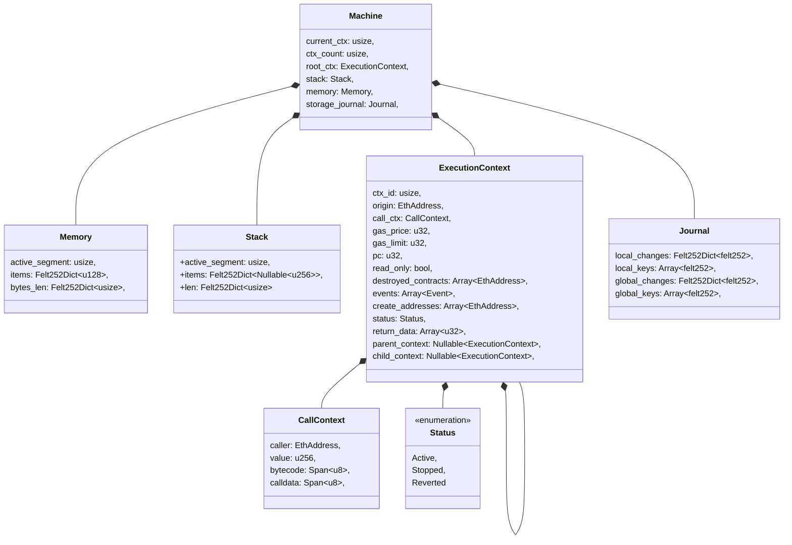

# Kakarot's EVM - Internal Design

The EVM is a stack-based computer responsible for the execution of EVM bytecode.
It has two context-bound data structures: the stack and the memory. The stack is
a 256bit-words based data structure used to store and retrieve intermediate
values during the execution of opcodes. The memory is a byte-addressable data
structure organized into 32-byte words used a volatile space to store data
during execution. Both the stack and the memory are initialized empty at the
start of a call context, and destroyed when a call context ends.

The initial design of Kakarot's EVM had a single struct to model the execution
context, which contained the stack, the memory, and the execution state. Each
local execution context optionally contained parent and child execution
contexts, which were used to model the execution of sub-calls. However, this
design was not possible to implement in Cairo, as Cairo does not support the use
of Nullable types containing dictionaries. Since the ExecutionContext struct
mentioned in [execution_context](./execution_context.md) contains such Nullable
types, we had to change the design of the EVM to use a machine with a single
Stack and Memory, which are our dict-based data structures.

## The Kakarot Machine design

To overcome the problem stated above, we have come up with the following design:

- There is only one instance of the Memory and the Stack, which is shared
  between the different execution contexts.
- Each execution context has its own identifier `id`, which uniquely identifies
  it.
- Each execution context has a `parent_context` field, whose value is either the
  identifier of its parent execution context or `null`.
- Each execution context has a `child_context` field, whose value is either the
  identifier of its child context or `null`.
- The execution context tree is a directed acyclic graph, where each execution
  context has at most one parent, and at most one child.
- A specific execution context is accessible by traversing the execution context
  tree, starting from the root execution context, and following the execution
  context tree until the desired execution context is reached.
- The execution context tree is initialized with a single root execution
  context, which has no parent and no child.

The following diagram describes the model of the Kakarot Machine.



### The Stack

Instead of having one Stack per execution context, we have a single Stack shared
between all execution contexts. Because our Stack is a dict-based data
structure, we can actually simulate multiple stacks by using different keys for
each execution context. The `active_segment` field of the Stack is used to keep
track of the current active execution context. The `len` field is a dictionary
field is a dictionary mapping execution context identifiers to the length of
their corresponding stacks. The `items` field is a dictionary mapping indexes to
values.

The EVM imposes a limit of a maximum of 1024 items on the stack. At any given
time, the stack relative to an execution context contains at most 1024 items.
This means that if we consider items to be stored at sequential indexes, the
stack relative to an execution context is a contiguous segment of the global
stack of maximum size `1024`. When pushing an item to the stack, we will compute
an index which corresponds to the index in the dict the item will be stored at.
The internal index is computed as follows:

$$index = len(Stack_i) + i \cdot 1024$$

where $i$ is the id of the active execution context.

If we want to push an item to the stack of the root context, the internal index
will be $index = len(Stack_0) + 0 \cdot 1024 = len(Stack_0)$.

The process is analogous for popping an item from the stack.

### The Memory

The Memory is modeled in a similar way to the Stack. The difference is that the
memory doesn't have a limit on the number of items it can store. Instead, the
cost of expanding the size of the memory grows quadratically relative to its
size. Given that an Ethereum block has a gas limit, we can assume that the
maximum size of the memory is bounded by the gas limit of a block, which is 30M
gas.

The expansion cost of the memory is defined as follows in the Ethereum Yellow
Paper:

$$C_{mem}(a) \equiv G_{memory} · a + [\frac{a^2}{512}]$$

where $G_{memory} = 3$ and $a$ is the number of 32-byte words allocated.

Following this formula, the gas costs required to have a memory containing
125000 words is above the 30M gas limit. We will use this heuristic to bound the
maximum size of the memory to the closest power of two to 125000: $2^17$.
Therefore, we will bound the maximum size of the memory to 131072 256-bits
words.

The internal index at which an item will be inserted in the memory, given a
specific offset, is computed as:

$$index = offset + i \cdot 131072$$

where $i$ is the id of the active execution context.

If we want to store an item at offset 10 of the memory relative to the execution
context of id 1, the internal index will be
$index = 10 + 1 \cdot 131072 = 131082$.

### Tracking storage changes

The EVM has a persistent storage, which is a key-value store. The storage
changes are tracked in the `journal` field of the Machine. This field is a
dictionary mapping storage slots addresses modified by the current execution
context to their most recent value. For more information on how storage is
managed in Kakarot, read [contract_storage](./contract_storage.md).

We encounter the same constraints as for the Stack and the Memory, as the
storage changes are tracked using a dictionary; meaning that it can't be a part
of the ExecutionContext struct. Therefore, we will track the storage changes in
the Machine struct. What we want to achieve is the following:

- Track the storage changes performed in the transaction as a whole.
- Track the storage changes performed in the current execution context.
- Rollback the storage changes performed in the current execution context when
  the execution context is reverted.
- Finalize the storage changes performed in the transaction when the transaction
  is finalized.

Considering Cairo's limitations raised previously, we will use a single data
structure to track local and global storage changes. We will use a `Journal`
data structure, that will track two things: the changes performed in the current
execution context, and the changes performed in the transaction as a whole. The
Journal will have the following fields:

```rust
  struct Journal {
      local_changes: Felt252Dict<u256>,
      local_keys: Array<u256>,
      global_changes: Felt252Dict<u256>,
      global_keys: Array<u256>,
  }
```

The `local_changes` field is a dictionary mapping storage slots addresses to the
most recent changes, performed in the local execution context. The `local_keys`
field is used to track the indexes of the storage slots addresses in the
dictionary in order to be able to iterate over the dictionary. Similarly, the
`global_changes` field is a dictionary mapping storage slots addresses to the
changes performed in the transaction as a whole. The `global_keys` tracks the
indexes of these storage slots addresses in the dictionary.

When an execution contexts stops, we will commit the local changes to the global
changes by inserting the local changes in the `global_changes` dictionary, and
updating the `global_keys` array. When the transaction is finalized, we will
iterate over the `global_changes` dictionary, and perform the required storage
updates, as mentioned in [Contract Storage](./contract_storage.md).

## Conclusion

With its shared stack and memory accessed via calculated internal indexes
relative to the current execution context, this EVM design remains compatible
with the original EVM design, easily refactorable if we implement all
interactions with the machine through type methods, and compatible with Cairo's
limitations.
