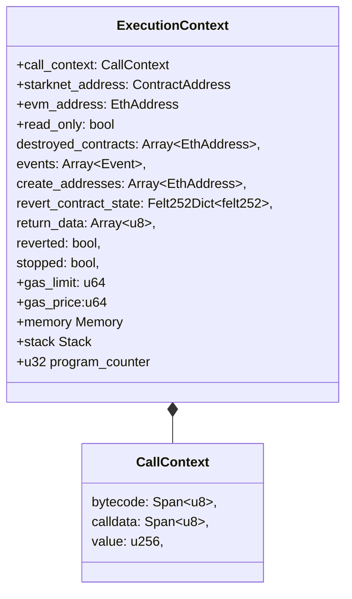
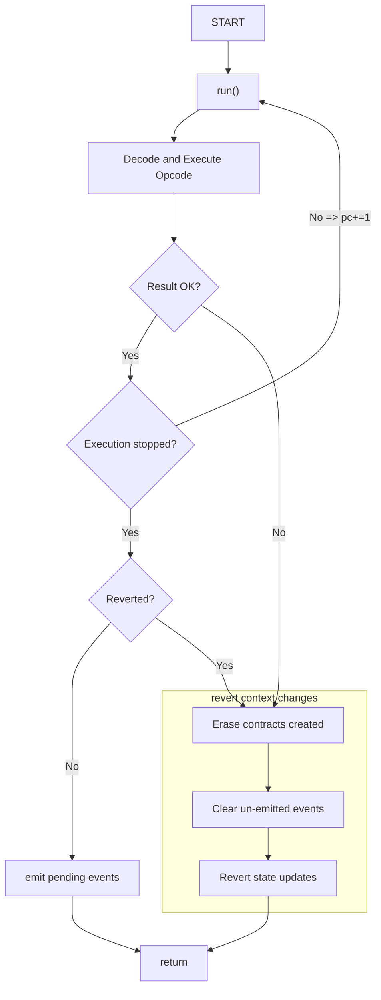

# Kakarot's Execution Context

The execution context is the environment in which the EVM bytecode code is
executed. It is modeled through the ExecutionContext struct, which contains the
following fields

> Note: the
> [actual implementation of the execution context](https://github.com/kkrt-labs/kakarot-ssj/blob/main/crates/evm/src/context.cairo#L163)
> doesn't match the description below, as some fields are packed together in
> sub-structs for optimisation purposes. However, the general idea remains the
> same.

When submitting a transaction to the EVM, the `call_context` field of the
`ExecutionContext` is initialized with the bytecode of the contract to execute,
the call data sent in the transaction, and the value of the transaction. The
stack and memory are initialized empty.

Executing opcodes mutates the execution context. For example, executing the ADD
opcode removes the top two elements from the stack and pushes back their sum.

## Run execution flow

The following diagram describe the flow of the execution context when executing
the `run` function given an instance of the `ExecutionContext` struct.

The run function is responsible for executing EVM bytecode. The flow of
execution involves decoding and executing the current opcode, handling the
execution, and continue executing the next opcode if the execution of the
previous one succeeded. If the execution of an opcode fails, the execution
context reverts and all the changes made to the blockchain state are reverted.

<!-- TODO -->

> Note: The revert context changes subgraph is not implemented yet.

> Note: The event emission is not implemented yet.
